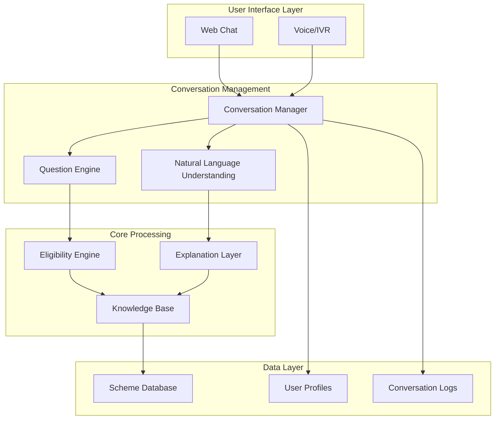

# Design Document: AI Government Scheme & Entitlement Navigator

## Overview

The AI Government Scheme Navigator is a conversational AI system that helps rural citizens discover and understand government schemes they are eligible for. The system uses a multi-layered architecture combining rule-based eligibility determination with LLM-powered natural language processing to provide accurate, accessible, and user-friendly scheme navigation.

The system addresses the critical problem of low government scheme utilization in rural areas by providing a simple, conversational interface that works through familiar channels like WhatsApp and supports local languages.

## Architecture

The system follows a modular architecture with clear separation of concerns:



### Key Architectural Principles

1. **Separation of Concerns**: Rule-based eligibility logic is separate from conversational AI
2. **Multi-Channel Support**: Unified backend supporting multiple user interfaces
3. **Scalable Processing**: Stateless components for horizontal scaling
4. **Data Privacy**: Encrypted storage and processing of sensitive user information
5. **Reliability**: Graceful degradation and error recovery mechanisms

## Components and Interfaces

### 1. User Interface Layer

**Web Chat Interface**
- Browser-based chat widget
- Responsive design for mobile and desktop
- Real-time messaging using WebSocket connections
- Accessibility features for screen readers

**Voice/IVR Interface** (Optional)
- Speech-to-text conversion for voice input
- Text-to-speech for voice responses
- DTMF support for basic navigation
- Integration with telephony providers

### 2. Conversation Manager

**Core Responsibilities:**
- Session management and context tracking
- Message routing between interfaces and processing engines
- Conversation state persistence
- Multi-turn conversation handling

**Key Methods:**
```
processMessage(userId, message, channel) -> Response
getConversationContext(userId) -> Context
updateUserProfile(userId, profileData) -> Boolean
resetConversation(userId) -> Boolean
```

### 3. Question Engine

**Adaptive Questioning Logic:**
- Determines what information is needed for eligibility determination
- Asks follow-up questions based on user responses
- Stops questioning when sufficient information is collected
- Handles ambiguous or incomplete responses

**Question Selection Algorithm:**
1. Analyze current user profile completeness
2. Identify missing critical attributes for top schemes
3. Prioritize questions by information value
4. Generate contextual, simple language questions
5. Track question history to avoid repetition

### 4. Eligibility Engine

**Rule-Based Processing:**
- Evaluates user profiles against scheme eligibility criteria
- Supports complex rule combinations (AND, OR, NOT operations)
- Handles range-based criteria (age, income brackets)
- Provides confidence scores for eligibility matches

**Rule Structure:**
```json
{
  "schemeId": "pm-kisan",
  "rules": {
    "occupation": ["farmer", "agricultural_worker"],
    "landOwnership": ["owner", "tenant"],
    "landSize": {"min": 0, "max": 2},
    "income": {"max": 200000}
  },
  "priority": 1
}
```

### 5. Explanation Layer

**LLM-Powered Explanations:**
- Converts technical eligibility rules into simple language
- Generates scheme summaries and benefit explanations
- Provides application guidance and document requirements
- Supports multiple local languages

**Key Functions:**
- Rule-to-text conversion
- Benefit summarization
- Application process explanation
- FAQ handling

### 6. Knowledge Base

**Scheme Data Management:**
- Structured storage of scheme information
- Version control for scheme updates
- Search and retrieval optimization
- Data validation and consistency checks

**Data Schema:**
```json
{
  "scheme": {
    "id": "string",
    "name": "string",
    "description": "string",
    "benefits": "string",
    "eligibilityRules": "object",
    "applicationProcess": "array",
    "requiredDocuments": "array",
    "contactInfo": "object",
    "lastUpdated": "datetime"
  }
}
```

## Data Models

### User Profile Model
```json
{
  "userId": "string",
  "demographics": {
    "age": "number",
    "gender": "string",
    "location": {
      "state": "string",
      "district": "string",
      "village": "string"
    }
  },
  "economic": {
    "occupation": "string",
    "annualIncome": "number",
    "landOwnership": "string",
    "landSize": "number"
  },
  "social": {
    "casteCategory": "string",
    "familySize": "number",
    "dependents": "number"
  },
  "preferences": {
    "language": "string",
    "channel": "string"
  },
  "createdAt": "datetime",
  "updatedAt": "datetime"
}
```

### Conversation Context Model
```json
{
  "sessionId": "string",
  "userId": "string",
  "currentState": "string",
  "collectedInfo": "object",
  "questionHistory": "array",
  "lastInteraction": "datetime",
  "channel": "string"
}
```

### Scheme Eligibility Result Model
```json
{
  "userId": "string",
  "eligibleSchemes": [
    {
      "schemeId": "string",
      "schemeName": "string",
      "confidenceScore": "number",
      "benefits": "string",
      "applicationSteps": "array",
      "requiredDocuments": "array",
      "deadlines": "array"
    }
  ],
  "generatedAt": "datetime"
}
```

## Correctness Properties

*A property is a characteristic or behavior that should hold true across all valid executions of a system—essentially, a formal statement about what the system should do. Properties serve as the bridge between human-readable specifications and machine-verifiable correctness guarantees.*

### Property 1: Adaptive Profile Collection
*For any* user session, when the system starts collecting profile information, it should ask for all essential profile fields, ask follow-up questions for any missing information, and stop questioning once sufficient information is collected for eligibility determination.
**Validates: Requirements 1.1, 1.3, 1.4**

### Property 2: Voice Input Processing
*For any* voice input provided to the system, when voice support is available, the system should correctly process the spoken response and continue the conversation appropriately.
**Validates: Requirements 1.5**

### Property 3: Comprehensive Scheme Evaluation
*For any* complete user profile, the eligibility engine should evaluate all schemes in the knowledge base and apply the correct rule-based filters for age, income, location, caste category, and occupation.
**Validates: Requirements 2.1, 2.2**

### Property 4: Multiple Scheme Ranking
*For any* user profile that matches multiple schemes, the system should return all eligible schemes ranked by relevance with complete information for each.
**Validates: Requirements 2.3**

### Property 5: Eligibility Accuracy
*For any* user profile with known correct eligibility results, the eligibility engine should maintain at least 95% accuracy in its determinations.
**Validates: Requirements 2.5**

### Property 6: Complete Scheme Information
*For any* eligible scheme presented to a user, the response should include scheme name, benefits summary, application process, required documents, application deadlines, and contact information.
**Validates: Requirements 3.1, 3.3**

### Property 7: Language Support
*For any* user request for local language support, the system should provide explanations and responses in the user's preferred language.
**Validates: Requirements 3.4**

### Property 8: Knowledge Base Query Response
*For any* follow-up question about schemes, the system should provide relevant answers using information from the knowledge base.
**Validates: Requirements 3.5**

### Property 9: Cross-Channel Context Preservation
*For any* user switching between communication channels (web chat, voice), the system should maintain conversation context and continue from where the conversation left off.
**Validates: Requirements 4.3**

### Property 10: Knowledge Base Data Integrity
*For any* scheme stored in the knowledge base, all required data fields (eligibility rules, benefits, application procedures) should be present and properly structured, and new schemes should be immediately available for eligibility evaluation.
**Validates: Requirements 5.1, 5.4**

### Property 11: Real-time Data Updates
*For any* scheme information update in the knowledge base, eligibility determinations should immediately reflect the changes in subsequent evaluations.
**Validates: Requirements 5.2**

### Property 12: PDF Parsing Round-trip
*For any* valid scheme PDF document, parsing and structuring the document should extract all essential scheme information accurately and make it available for eligibility evaluation.
**Validates: Requirements 5.3**

### Property 13: Version Control Maintenance
*For any* change made to scheme data, the knowledge base should maintain a complete version history that can be retrieved for audit purposes.
**Validates: Requirements 5.5**

### Property 14: Clarification Request Behavior
*For any* unclear or ambiguous user input, the system should ask appropriate clarifying questions to maintain conversation context.
**Validates: Requirements 6.2**

### Property 15: Profile Modification Support
*For any* user request to restart or modify their profile, the system should allow the changes and update the profile accordingly.
**Validates: Requirements 6.3**

### Property 16: Session History Maintenance
*For any* active user session, the system should maintain complete conversation history and make it available throughout the session.
**Validates: Requirements 6.4**

### Property 17: Data Encryption
*For any* sensitive personal information processed by the system, the data should be encrypted both in storage and during transmission.
**Validates: Requirements 7.1**

### Property 18: Performance Response Time
*For any* complete user profile submitted for eligibility determination, the system should return results within 5 seconds.
**Validates: Requirements 7.3**

### Property 19: Privacy-Protected Logging
*For any* user interaction with the system, the interaction should be logged for system improvement while ensuring user privacy protection measures are in place.
**Validates: Requirements 7.5**

### Property 20: Comprehensive Error Handling
*For any* invalid, contradictory, or error-causing user input, the system should provide polite clarification requests or helpful error messages with recovery options.
**Validates: Requirements 8.1, 8.2**

### Property 21: Graceful Service Degradation
*For any* external service outage, the system should continue operating using cached data where possible and inform users of any limitations.
**Validates: Requirements 8.3**

## Error Handling

The system implements comprehensive error handling across all components:

### Input Validation Errors
- **Invalid Profile Data**: When users provide data outside expected ranges or formats, the system requests clarification with examples
- **Incomplete Responses**: Missing information triggers adaptive follow-up questions rather than errors
- **Contradictory Information**: The system identifies conflicts and asks users to resolve them

### System Errors
- **LLM Service Failures**: Fallback to cached responses and rule-based explanations
- **Database Connectivity Issues**: Use cached scheme data with user notification of potential staleness
- **External API Failures**: Graceful degradation with alternative contact methods provided

### Performance Errors
- **Timeout Handling**: Requests exceeding time limits receive partial results with retry options
- **Rate Limiting**: Queue management prevents system overload while maintaining user experience
- **Memory Constraints**: Efficient data structures and garbage collection prevent memory issues

### Recovery Mechanisms
- **Conversation Reset**: Users can restart conversations at any point
- **Profile Correction**: Easy modification of previously provided information
- **Alternative Channels**: Fallback communication methods when primary channels fail

## Testing Strategy

The testing approach combines unit testing for specific functionality with property-based testing for universal correctness guarantees.

### Property-Based Testing
- **Framework**: Use Hypothesis (Python) or fast-check (JavaScript) for property-based test generation
- **Test Configuration**: Minimum 100 iterations per property test to ensure comprehensive coverage
- **Data Generation**: Custom generators for user profiles, scheme data, and conversation contexts
- **Property Validation**: Each correctness property implemented as a separate property-based test

### Unit Testing
- **Component Testing**: Individual component functionality with mocked dependencies
- **Integration Testing**: End-to-end conversation flows and data processing pipelines
- **Edge Case Testing**: Boundary conditions, empty inputs, and error scenarios
- **Performance Testing**: Response time validation and load testing

### Test Data Management
- **Synthetic Scheme Data**: Generated test schemes with known eligibility rules
- **User Profile Variations**: Comprehensive coverage of demographic and economic combinations
- **Conversation Scenarios**: Pre-defined conversation flows for regression testing

### Continuous Testing
- **Automated Test Execution**: All tests run on code changes and deployments
- **Property Test Monitoring**: Track property test failures and success rates
- **Performance Benchmarking**: Continuous monitoring of response times and accuracy metrics

Each property-based test will be tagged with the format: **Feature: ai-government-scheme-navigator, Property {number}: {property_text}** to ensure traceability between design properties and test implementations.